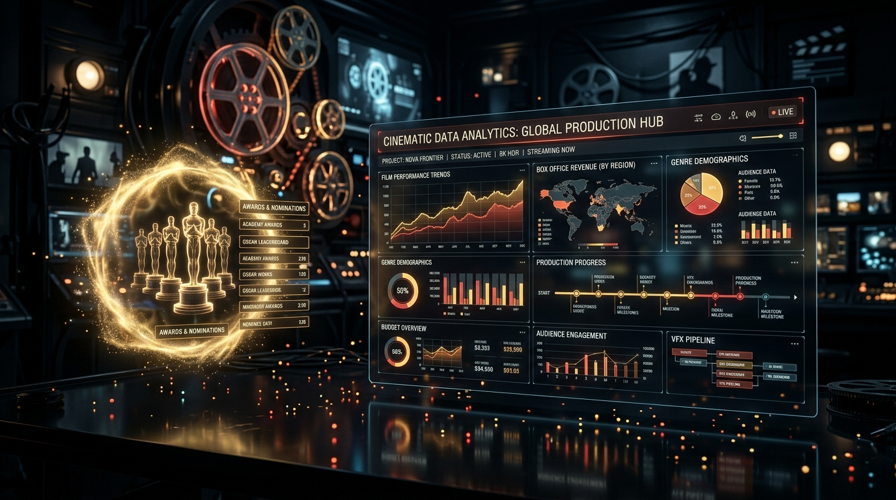

# 🎬 CineMetrics: Flask Movie Data Analysis & Box Office Intelligence Dashboard

An econometric, data-driven cinema analytics dashboard and statistical intelligence platform powered by a **Python Flask** REST API backend and a responsive glassmorphic frontend.



---

## 🌟 Key Highlights & Features

### 1. Python Flask Backend & REST API
- **`GET /`**: Renders the dynamic dashboard template via Jinja2.
- **`GET /api/movies`**: Dynamic filtering and sorting engine (search by title/director/actor, filter by genre, era, budget tier, and minimum IMDb rating).
- **`GET /api/insights`**: Computes real-time econometric metrics, Pearson correlation coefficients ($r$), genre revenue shares, and director power rankings.
- **`POST /api/upload`**: Validates and parses uploaded CSV datasets, automatically computing net profits, ROI multipliers, and reloading the dashboard.
- **`POST /api/reset`**: Resets the active dataset back to the benchmark 72 iconic movies.
- **`GET /api/export/csv`** & **`GET /api/export/json`**: Streams custom or active dataset downloads directly from Flask.

### 2. Executive Performance Metrics (Live KPIs)
- **Worldwide Box Office Gross**: Dynamic aggregation with net profit computation (₹52.63B gross, ₹45.46B net profit across benchmark dataset).
- **Total Production Investment**: Aggregate and average production capital per title.
- **Overall Market ROI %**: Real-time calculated return on investment multiplier (7.34x return on capital).
- **Audience & Critical Reception**: Dynamic average IMDb score and Metascore benchmarking.

### 3. Interactive Econometric Visualizations (Chart.js)
- **Budget vs. Worldwide Revenue Scatter / Bubble Plot**: Identifies explosive ROI outliers, sleeper hits, and high-budget franchise juggernauts (Circle radius scales with ROI %).
- **Genre Market Share Doughnut**: Analyzes cumulative global box office contribution partitioned across Action, Sci-Fi, Drama, Animation, Comedy, Crime, and Horror.
- **Cinema Evolution Across Eras (Line / Area Chart)**: Visualizes historical trends in box office grosses and budgets alongside audience rating stability from the 1970s to 2024.
- **Director Power Rankings (Horizontal Bar Chart)**: Ranks top directors (James Cameron, Christopher Nolan, Russo Brothers, Jon Watts, Steven Spielberg) by worldwide gross.
- **IMDb Rating vs. ROI % Correlation**: Investigates whether critically acclaimed films yield higher percentage returns than mainstream crowd-pleasers.

### 4. Interactive Movie Explorer (Grid & Table Views)
- **Card Grid View**: High-resolution posters, genre tags, budget vs. revenue comparison bars, and color-coded ROI badges.
- **Data Table View**: Dense, sortable statistical table with direct column sorting (Budget, Gross, Profit, ROI, Rating).
- **Movie Detail Modal**: Comprehensive breakdown including synopsis, cast, runtime, country, awards won (Oscars, Golden Globes), and budget-to-profit split gauge.

---

## 🗂️ Project Directory Structure

```
├── app.py                   # Python Flask web server & REST API
├── requirements.txt         # Dependencies (Flask >= 3.0)
├── run.sh                   # Startup script (creates venv and launches server)
├── analyze_movies.py        # Standalone data science script & correlation engine
├── templates/
│   └── index.html           # Jinja2 Dashboard HTML template
├── static/
│   ├── css/
│   │   └── style.css        # Cinematic dark-mode design system & glassmorphism
│   ├── js/
│   │   └── dashboard.js     # Client-side dynamic interaction & Chart.js logic
│   ├── data/
│   │   └── movies.js        # JavaScript dataset fallback
│   └── assets/
│       └── hero_banner.jpg  # Banner artwork
├── data/
│   ├── movies.json          # Curated dataset (72 films)
│   ├── movies.csv           # Tabular dataset
│   └── insights_report.json # Statistical report
└── README.md                # Project documentation
```

---

## 🚀 How to Run the Flask Application

### 1. Quick Launch (Recommended)
Run the automated startup script:

```bash
./run.sh
```

Or run manually:

```bash
# Activate virtual environment
source venv/bin/activate

# Start the Flask app
PORT=5001 python app.py
```

Open your browser and navigate to:
```
http://localhost:5001
```

### 2. Standalone Statistical Engine (Terminal)
To run the statistical analysis and correlation calculations directly in terminal:

```bash
python3 analyze_movies.py
```

---

## 📐 Formulas & Statistical Metrics

1. **Return on Investment (ROI %)**:
   $$\text{ROI} = \left( \frac{\text{Worldwide Gross} - \text{Production Budget}}{\text{Production Budget}} \right) \times 100$$

2. **Net Profit (₹)**:
   $$\text{Profit} = \text{Worldwide Gross} - \text{Production Budget}$$

3. **Pearson Correlation Coefficient ($r$)**:
   $$r = \frac{\sum (x_i - \bar{x})(y_i - \bar{y})}{\sqrt{\sum (x_i - \bar{x})^2 \sum (y_i - \bar{y})^2}}$$
